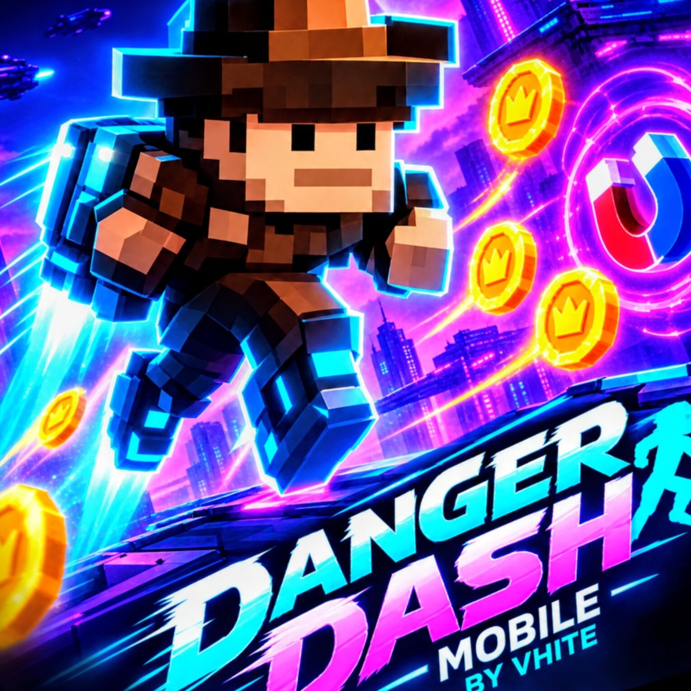

# 🎮 DangerDash Mobile

<p align="center">
  
</p>

<h1 align="center">⚡ DANGER DASH MOBILE ⚡</h1>

<p align="center">
  <strong>A fast-paced 2D platform runner built for mobile.</strong>
</p>

<p align="center">
  Jump • Dash • Collect • Survive • Upgrade • Challenge Yourself
</p>

<p align="center">
  
  
  
  
</p>

---

## 🚀 About

**DangerDash Mobile** is a fast-paced 2D endless platform runner designed for Android.

The goal is simple: **keep moving, jump over danger, collect rewards, use abilities, and beat your records.**

As the run continues, platforms, gaps, hazards, and gameplay mechanics create increasingly challenging situations.

### Core features

- 🏃 Endless running gameplay
- 🦘 Jump and power-jump mechanics
- 🧱 Dynamic platforms and gaps
- 📐 Platform height variation in later levels
- 🌊 Environmental hazards
- 🪙 Coin collection
- ⚡ Power-ups and boosts
- 🛡️ Shields
- 🧲 Magnet ability
- 🔄 Gravity mechanics
- 🔥 Combo and score systems
- 🎯 Daily challenges
- 🛒 Shop and upgrades
- 🎨 Multiple visual themes
- 💾 Local progression and high scores
- 🔊 Music and sound effects
- 📳 Haptic feedback
- 📱 Mobile-first controls

---

## 🎮 Gameplay

DangerDash uses an endless running loop where the character moves through a continuously changing platform environment.

Tap the game area to jump and navigate water, gaps, hazards, and dangerous platform sections.

### ⚡ Abilities

Different abilities can change how a run plays, including:

- 🧲 Magnet
- 🛡️ Shield
- ⚡ Boost
- 🚀 Power Jump
- 🔄 Gravity-related abilities

Timing and ability usage become increasingly important as the run progresses.

---

## 🧱 Dynamic Platforms

Platforms are procedurally varied to make runs less predictable.

The game can vary:

- Platform width
- Horizontal gaps
- Platform height
- Gameplay situations

From **Level 3 onward**, platform heights can vary between **high, medium, and low**, while keeping low platforms safely above the water surface.

---

## 🎯 Daily Challenges

Daily Challenges provide objectives beyond simply chasing a high score.

Challenges can involve collecting coins, using power-ups, reaching scores, building combos, collecting shields, performing jumps, using abilities, reaching speed milestones, and surviving runs.

Completed challenges provide rewards and can trigger local system notifications. A notification indicator can also appear on the **DAILY** button.

---

## 🏆 Score & Progression

DangerDash keeps track of gameplay and progression such as:

- High score
- Total coins
- Total runs
- Deaths
- Jumps
- Power-ups used
- Shields collected
- Gravity abilities
- Combos
- Maximum speed
- Daily challenge progress

Progress is stored locally on the device.

---

## 🛒 Shop & Upgrades

Collected coins can be used for gameplay upgrades such as:

- 🦘 Extra Jump
- 🧲 Magnet Range
- 🌙 Slow Fall

The upgrade system adds progression while keeping the core controls simple.

---

## 🎨 Visual Themes

DangerDash separates gameplay systems from themed visual assets, allowing different environments without rebuilding the core gameplay.

### 🌃 Cyberpunk

A futuristic arcade environment featuring dark backgrounds, purple lighting, cyan/neon effects, glowing gameplay elements, and futuristic scenery.

### 🪵 Wooden

A classic platform-game environment with its own backgrounds, platforms, hazards, water, character assets, and effects.

---

## 📱 Mobile Experience

DangerDash is designed specifically around touch devices.

The interface includes:

- ⏸️ Pause
- 🔙 Navigation
- 🎯 Daily Challenges
- 🛒 Shop
- ⚙️ Options

The game uses a virtual **800 × 450** canvas that scales to different mobile displays while maintaining the intended aspect ratio.

---

## ⚙️ Tech Stack

| Area | Technology |
|---|---|
| Framework | React Native |
| Runtime / Tooling | Expo SDK 57 |
| Language | JavaScript |
| 2D Graphics | React Native Skia |
| Storage | AsyncStorage |
| Audio | Expo Audio |
| Notifications | Expo Notifications |
| Haptics | Expo Haptics |
| Gradients | Expo Linear Gradient |
| Device Orientation | Expo Screen Orientation |
| Speech | Expo Speech |

---

## 🧠 Game Architecture

The core gameplay follows a continuous update cycle:

```text
Player Input
     ↓
Jump / Ability
     ↓
Physics & Movement
     ↓
Platform Collision
     ↓
Item Collision
     ↓
Hazard Detection
     ↓
Score & Progression
     ↓
Platform Generation
     ↓
Next Frame
```

The project separates rendering, gameplay logic, configuration, themes, storage, audio, notifications, and screens into reusable modules.

---

## 🔊 Audio & Feedback

The game includes background music, gameplay sound effects, coin and power-up feedback, game-over feedback, game quips, and haptic feedback.

Audio and related options can be managed from the game's settings.

---

## 💾 Local Save System

DangerDash uses local device storage for player progression, including:

```text
High Score
Coins
Skins
Equipped Skin
Upgrades
Runs
Challenge Progress
Completed Challenges
Gameplay Statistics
```

No online account is required for normal local progression.

---

# 📦 Download DangerDash

## 📱 Android APK

Download the latest APK here:

### 👉 [DOWNLOAD DANGERDASH MOBILE APK](https://expo.dev/artifacts/eas/C60tVx2dHtAd8DkvaHMYJ9cFKNep1ELtf2yw7smpujs.apk)

### 🧪 Installing the APK

1. Download the APK on an Android device.
2. Open the downloaded file.
3. If Android asks, allow installation from the source you used.
4. Install DangerDash.
5. Launch the game and start running.

> ⚠️ APKs installed outside Google Play may trigger Android security warnings. Only install builds from a source you trust.

---

## 🛠️ Run Locally

### Requirements

- Node.js
- npm
- Expo tooling
- Android Studio + Android SDK for native Android development
- Android device or emulator

### Installation

```bash
git clone https://github.com/Wilson-Edem/Dangerdash.git
cd Dangerdash
npm install
```

### Start Expo

```bash
npx expo start
```

### Run on Android

```bash
npx expo run:android
```

---

## 🗺️ Future Ideas

Possible future additions include:

- 🏆 Global leaderboards
- 👤 Player profiles
- 🌐 Online statistics
- 🎯 More daily challenges
- 🗺️ More environments
- 🧑‍🎨 More character skins
- ⚡ Additional power-ups
- 👾 Enemies
- 🏅 Achievements
- 🎮 Additional game modes
- ☁️ Cloud saves

---

## 🐛 Bug Reports & Feedback

Found a bug or have an idea?

Open an issue in the repository and, when possible, include:

- 📱 Device model
- 🤖 Android version
- 🎮 What you were doing
- 🐛 What happened
- ✅ What you expected
- 📸 Screenshot or screen recording

---

## 🤝 Contributions

DangerDash is primarily a personal development project, but feedback and technical suggestions are welcome.

If you contribute:

1. Fork the repository.
2. Create a feature branch.
3. Make your changes.
4. Test them.
5. Open a pull request.

---

## 📸 Screenshots

Gameplay screenshots, theme previews, and Daily Challenge demonstrations can be added here as the project evolves.

---

## 👨‍💻 Developer

**DangerDash Mobile** is developed by **Vhite**.

The project explores React Native, Expo, JavaScript, 2D rendering, game physics, procedural gameplay, mobile UI/UX, local storage, audio, notifications, and device APIs.

DangerDash was built as an experiment in creating a complete playable mobile game rather than another conventional website.

---

## ⭐ Support the Project

If you like DangerDash:

⭐ Star the repository  
🐛 Report bugs  
💡 Suggest features  
🎮 Test new builds  
📢 Share the project  
💻 Explore the source code

<p align="center">

## ⚡ KEEP RUNNING. KEEP JUMPING. DON'T STOP. ⚡

**Built with ❤️, JavaScript, React Native & a lot of debugging.**

</p>
